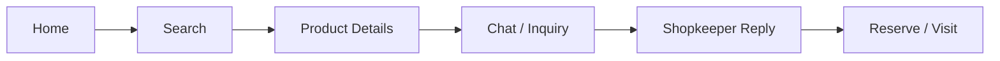
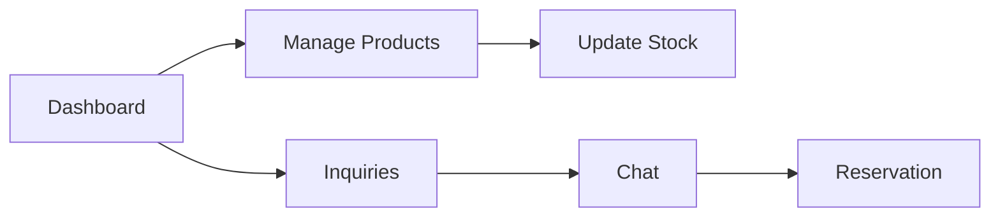

### Mohalla Mart — UI/UX

## Design Goal

Create a **simple and consistent** interface that helps customers discover local products and communicate with shopkeepers easily.

## Screen Map

| Screen | Purpose | Primary Action |
|---|---|---|
| Login / Signup | User access | Continue |
| Home / Search | Find products & shops | Search |
| Product Details | View product information | Ask / Chat |
| Shop Profile | View shop & catalog | Browse |
| Chat / Inquiry | Communicate with shopkeeper | Send |
| My Activity | View inquiries & reservations | View Details |
| Shopkeeper Dashboard | Manage shop & inquiries | Manage |

## Reusable Components

### Navigation
- Navbar
- Mobile Bottom Navigation
- Search Bar

### Product & Shop
- Product Card
- Product Grid/List
- Shop Card
- Product Image Gallery
- Stock/Availability Badge
- Category Filter
- Price Filter

### Communication
- Chat Window
- Message Bubble
- Inquiry Card
- Inquiry Status Badge
- Reservation Card

### Forms & Actions
- Button
- Input Field
- Select/Dropdown
- Form
- Modal/Confirmation Dialog
- Toast/Notification

### UI States
- Loading Skeleton
- Empty State
- Error State
- Success State

## Main User Flow

## Shopkeeper Flow

## UI Guidelines

- Mobile-first and responsive
- Consistent colors, typography and spacing
- One clear primary CTA per screen
- Realistic Indian names, dates and ₹ prices
- Loading, empty, error and success states
- Accessible labels, contrast and tap targets
- Keep important tasks within a simple 3-click flow

## Design Deliverables

- Screen map
- Low-fi wireframes
- Design system
- Reusable component library
- Clickable prototype
- Tailwind HTML skeleton
- UX review and fixes

### Project Skeleton

mohalla-mart/
│
├── frontend/
│   ├── pages/
│   │   ├── Login
│   │   ├── Home
│   │   ├── ProductDetails
│   │   ├── ShopProfile
│   │   ├── Chat
│   │   ├── MyActivity
│   │   └── ShopkeeperDashboard
│   │
│   ├── components/
│   │   ├── Navbar
│   │   ├── SearchBar
│   │   ├── ProductCard
│   │   ├── ShopCard
│   │   ├── StockBadge
│   │   ├── Filter
│   │   ├── ChatBox
│   │   ├── InquiryCard
│   │   ├── ReservationCard
│   │   ├── Modal
│   │   ├── Toast
│   │   └── LoadingSkeleton
│   │
│   └── styles/
│       └── design-system
│
├── backend/
│   ├── authentication
│   ├── shops
│   ├── products
│   ├── inquiries
│   ├── chat
│   ├── reservations
│   └── notifications
│
├── database/
│   ├── users
│   ├── shops
│   ├── products
│   ├── product_variants
│   ├── inquiries
│   ├── conversations
│   ├── messages
│   ├── reservations
│   └── notifications
│
├── integrations/
│   ├── location
│   ├── maps (optional)
│   └── whatsapp (optional)
